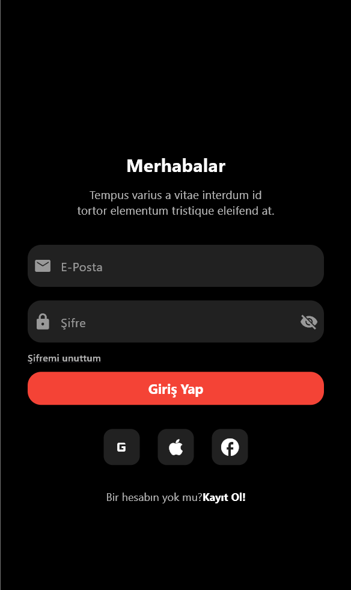
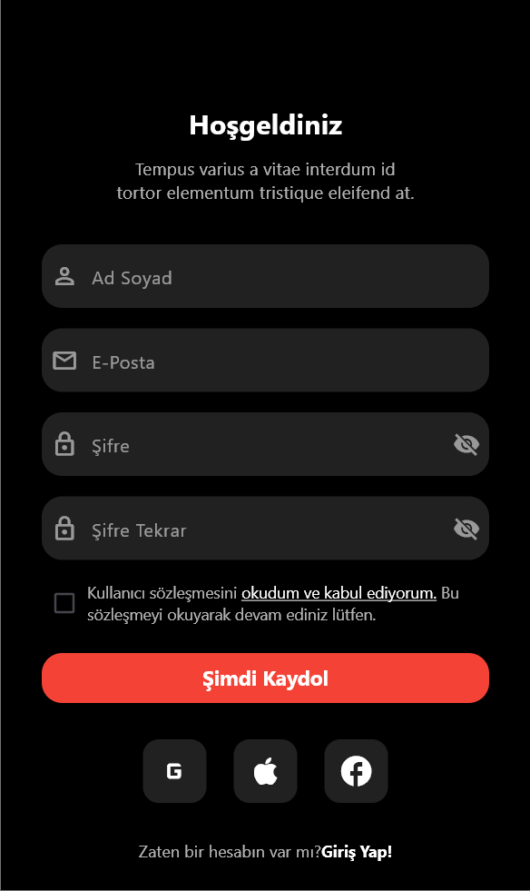
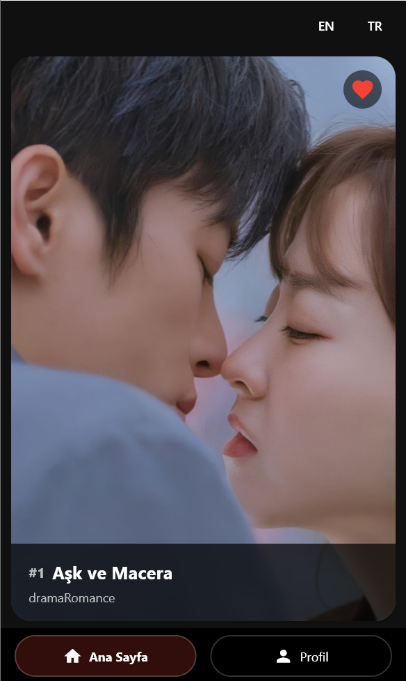
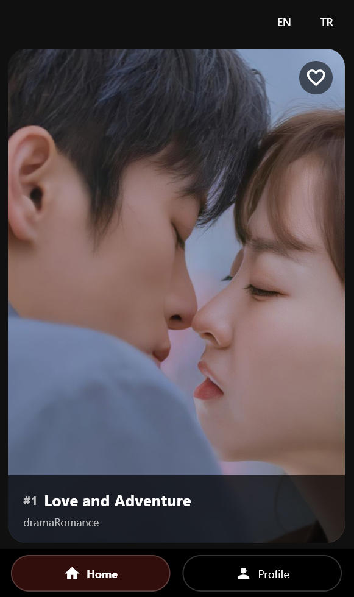
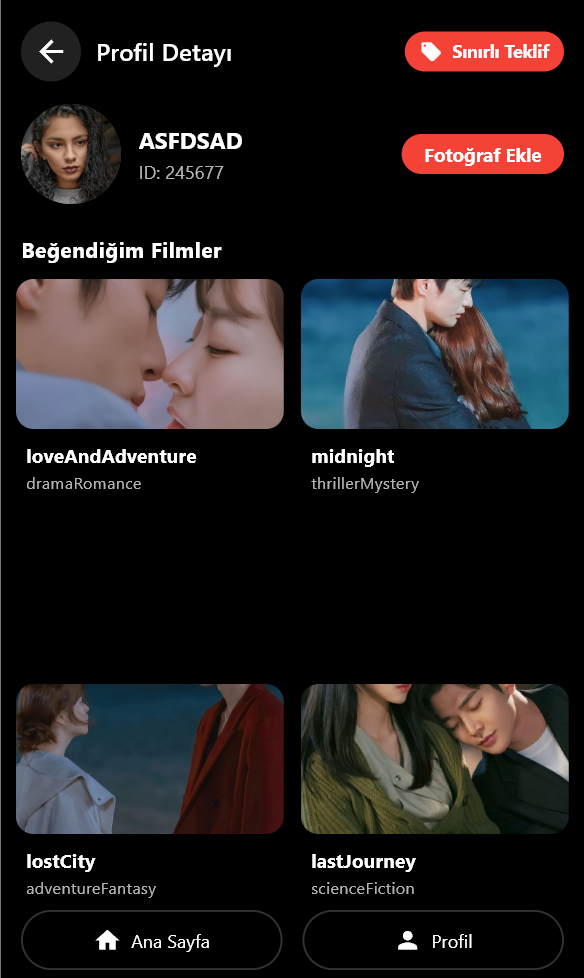
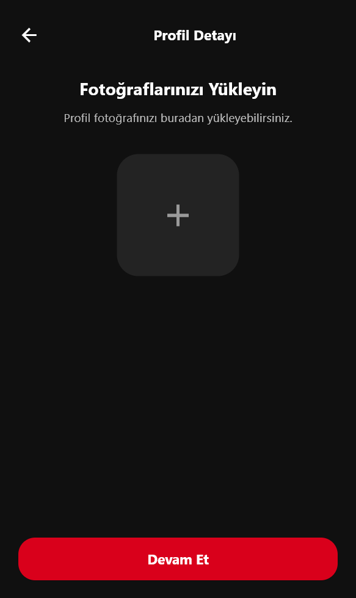
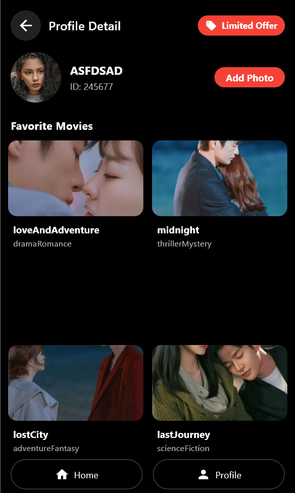
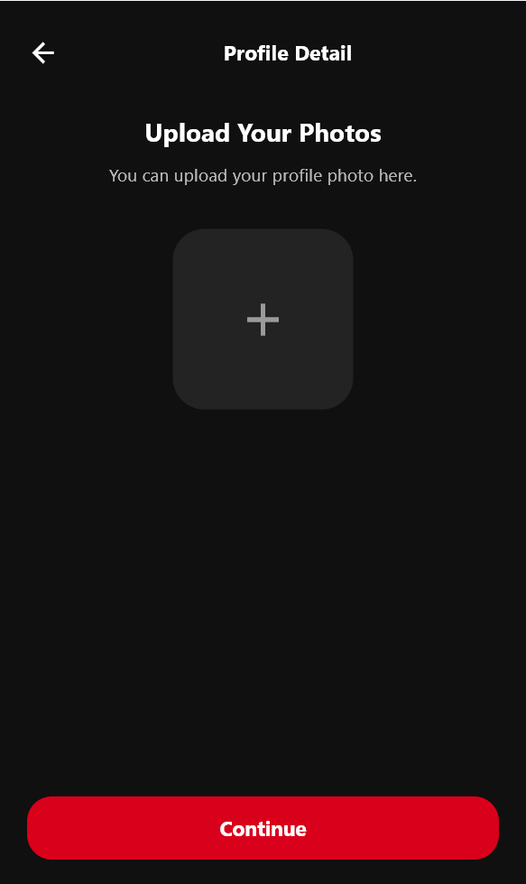
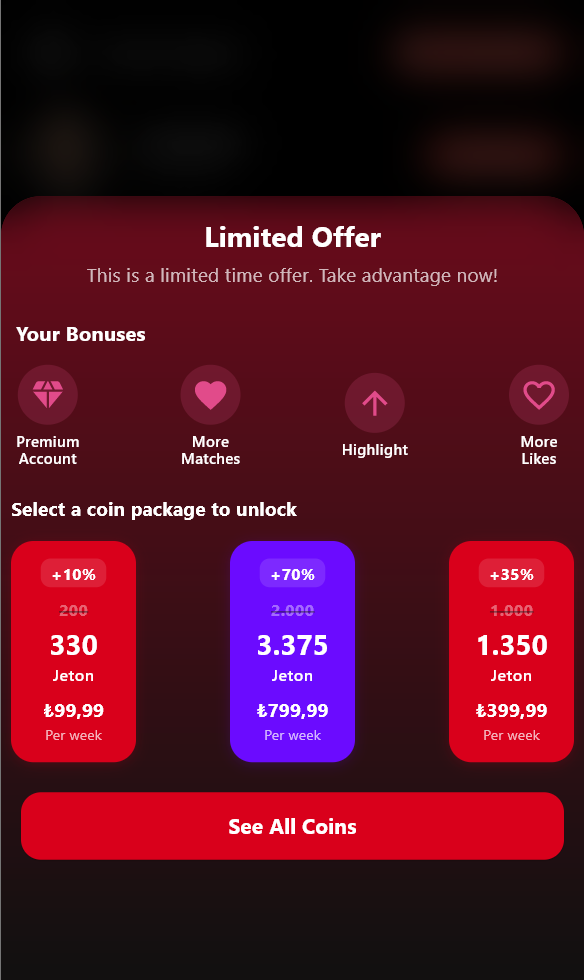

# Shartflix 🎬

Shartflix, modern Flutter teknolojileriyle geliştirilmiş, kullanıcıların film keşfetmesini, favori filmlerini yönetmesini ve profilini düzenlemesini sağlayan bir film uygulamasıdır. Uygulama, **Clean Architecture**, **MVVM** ve **Bloc** state management prensiplerine uygun şekilde yapılandırılmıştır.

---

## 🚀 Özellikler

### 👤 Kimlik Doğrulama
- Kullanıcı girişi ve kayıt işlemleri
- Token tabanlı oturum yönetimi
- Başarılı girişte otomatik yönlendirme

### 🏠 Ana Sayfa (Keşfet)
- Sonsuz kaydırma (Infinite Scroll)
- Her sayfada 5 film gösterimi
- Otomatik yükleme göstergesi
- Pull-to-refresh desteği
- Favori butonu ile anlık UI güncellemesi

### 🎥 Film Detayları
- Film başlığı, açıklama, çıkış tarihi, puan gibi detaylar

### ❤️ Favoriler
- Favorilere ekleme / çıkarma
- Favori listesi sayfası

### 🧑 Profil Yönetimi
- Kullanıcı bilgilerini görüntüleme
- Profil fotoğrafı yükleme

### 🔀 Navigasyon
- Bottom Navigation Bar ile akıcı sayfa geçişleri
- Ana sayfa state’inin korunması

### 🌐 Çoklu Dil Desteği
- Türkçe 🇹🇷 ve İngilizce 🇬🇧 localization (intl + ARB)

### 🎨 Tema
- Karanlık ve aydınlık tema desteği

### 🧰 Diğer Servisler
- Logger Service
- Navigation Service
- Splash Screen & Uygulama ikonu
- Firebase Crashlytics & Analytics (isteğe bağlı)

---

## 📸 Ekran Görüntüleri


<h3>Giriş & Kayıt Sayfası</h3>
<p>
  
  
</p>

<h3>Ana Sayfa (TR & EN)</h3>
<p>
  
  
</p>

<h3>Film Detayı (TR & EN)</h3>
<p>
  
  
</p>

<h3>Giriş & Kayıt Sayfası</h3>
<p>
  
  
</p>

<h3>Ana Sayfa (TR & EN)</h3>
<p>
  
  
</p>

<h3>Film Detayı (TR & EN)</h3>
<p>
  
  
</p>

<h3>Giriş & Kayıt Sayfası</h3>
<p>
  
  
</p>

<h3>Ana Sayfa (TR & EN)</h3>
<p>
  
  
</p>

<h3>Film Detayı (TR & EN)</h3>
<p>
  
  
</p>

<h3>Giriş & Kayıt Sayfası</h3>
<p>
  
  
</p>

<h3>Ana Sayfa (TR & EN)</h3>
<p>
  
  
</p>

<h3>Film Detayı (TR & EN)</h3>
<p>
  
  
</p>

<h3>Giriş & Kayıt Sayfası</h3>
<p>
  
  
</p>

<h3>Ana Sayfa (TR & EN)</h3>
<p>
  
  
</p>

<h3>Film Detayı (TR & EN)</h3>
<p>
  
  
</p>

<h3>Giriş & Kayıt Sayfası</h3>
<p>
  
  
</p>

<h3>Ana Sayfa (TR & EN)</h3>
<p>
  
  
</p>

<h3>Film Detayı (TR & EN)</h3>
<p>
  
  
</p>


### Giriş Sayfası


### Kayıt Ol Sayfası


### Ana Sayfa(Türkçe)


### Film Detayı Sayfası(Türkçe)


### Profil Sayfası(Türkçe)


### Profil Foto Ekle Sayfası(Türkçe)


### Teklifler Sayfası(Türkçe)


### Ana Sayfa(İngilizce)


### Film Detayı Sayfası(İngilizce)


### Profil Sayfası(İngilizce)


### Profil Foto Ekle Sayfası(İngilizce)


### Teklifler Sayfası(İngilizce)


## ⚙️ Kurulum ve Çalıştırma

### 1. Projeyi Klonlayın

```bash
git clone <repository-url>
2. Proje dizinine girin
bash
Kopyala
Düzenle
cd shartflix
3. Bağımlılıkları yükleyin
bash
Kopyala
Düzenle
flutter pub get
4. Uygulamayı çalıştırın
bash
Kopyala
Düzenle
flutter run
Emulator veya gerçek cihazın bağlı olduğundan emin olun.

🛠 Kullanılan Teknolojiler
Flutter & Dart

Bloc + MVVM Clean Architecture

REST API ile veri çekme

Lottie animasyonları

Firebase Crashlytics & Analytics (isteğe bağlı)

Localization (intl + ARB)

Logger & Navigation servisleri

🧪 Değerlendirme Kriterleri
✅ Kod kalitesi ve organizasyonu

✅ UI/UX tasarımına uygunluk

✅ Performans ve verimlilik

✅ Best Practice ve Clean Architecture kullanımı

✅ Bonus özelliklerin uygulanması

📬 İletişim
Her türlü soru, öneri ve geri bildirim için bana ulaşabilirsiniz:

📧 yusufbrkk12@gmail.com

💼 LinkedIn Profilim

🤝 Katkıda Bulun
Bu projeye katkıda bulunmak isterseniz:

Fork'layın 🍴

Yeni özellik geliştirin 🔧

Pull request gönderin ✅

⚠️ Not
Bu proje yalnızca teknik değerlendirme amacıyla hazırlanmıştır. Gerçek bir ürün değildir. Kodun bazı bölümleri güvenlik ve gizlilik nedeniyle paylaşılmamıştır.
